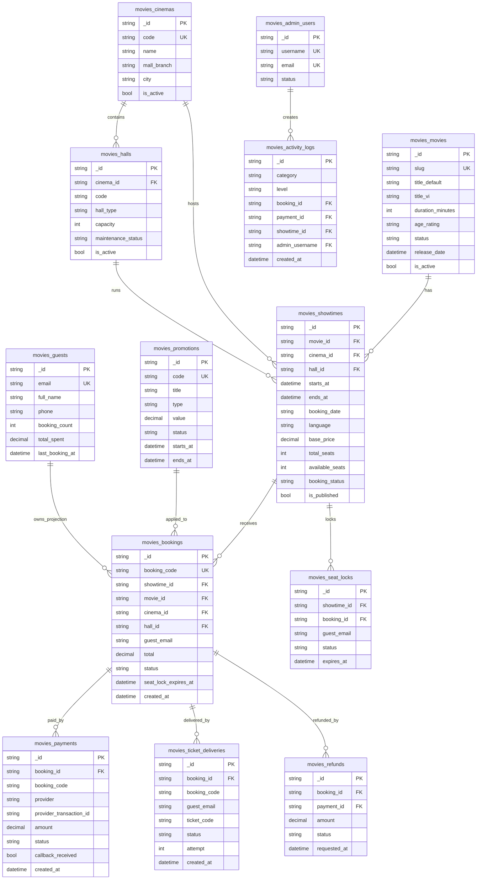

# Movies Module ERD Mermaid

## Purpose

This file provides a Mermaid ER diagram for the `Movies` module collections inside the `ABCDMall` MongoDB database.

Even though MongoDB is non-relational, this ERD is useful for:

- system design discussion
- backend planning
- API design
- admin/reporting logic

---

## Mermaid ER Diagram

---

## Notes

- `movies_guests -> movies_bookings` is a support/read-model relationship, not a strict transactional ownership
- `movies_activity_logs` may reference one or more entities depending on event type
- `movies_ticket_deliveries` and `movies_refunds` are operational support collections
